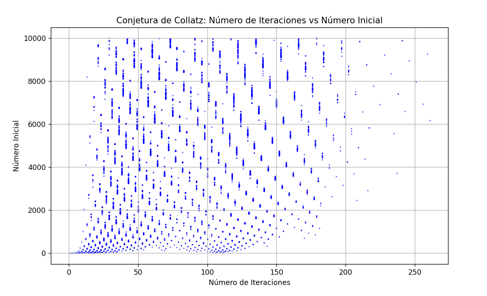

# Proyecto UADER IS2 - ESCAR CAMILO

## Introduccion
Este repositorio contiene codigo para distintos algoritmos en Python.

## Estructura de carpetas
- **src/**: Codigo fuente
- **doc/**: Documentación
- **bin/**: Ejecutables
- **script/**: Scripts

## Referencias
- [Python.org][https://www.python.org]

Pasos
PS C:\Users\camil> git --version
git version 2.47.1.windows.1

PS C:\Users\camil> Python --version
Python 3.13.1

PS C:\Users\camil> pip3  --version
pip 24.3.1 from C:\Python313\Lib\site-packages\pip (python 3.13)

repositorio creado y clonado
gh repo create UADER_IS2_ESCAR
Repositorio guardado en UADER24/ING2/TP1/UADER_IS2_ESCAR
git clone <https://github.com/CamiloEscar/UADER_IS2_ESCAR.git>

ingresamos a la carpeta
cd UADER_IS2_ESCAR

creamos la estructura de carpetas
mkdir src doc bin script

descargado y ejecutado
Python primos.py

eliminamos accidentalmente la carpeta src/primos.py
rmdir /s /q src

restauramos la carpeta desde el repositorio
git checkout src/primos.py
Updated 1 path from the index

agregamos primos al repositorio con comentarios

creamos el archivo README.md

sincronizamos

Instalacion de matplotlib y ejecucion de line.py
pip3 install matplotlib
python code/charts/line.py   

<!-- problemas para ejecutar line.py -->

descarga y ejecucion de factorial guardado en src/factorial
ejemplo:
python src/factorial.py 10
Factorial  10 ! es  3628800

creao el proyecto factorial_OOP con el comando
mkdir -p src/factorial_OOP
ejecutamos
python factorial_OOP.py 5
python factorial_OOP.py 4-8

guardamos cambios en github
git add src/factorial_OOP/factorial_OOP.py
PS C:\Users\camil\UADER 24\ING2\TP1\UADER_IS2_ESCAR> git commit -m "añadido de implementacion factorial_OOP para el calculo factorial"
[main 316a40e] añadido de implementacion factorial_OOP para el calculo factorial
 1 file changed, 89 insertions(+)
 create mode 100644 src/factorial_OOP/factorial_OOP.py
PS C:\Users\camil\UADER 24\ING2\TP1\UADER_IS2_ESCAR> git push origin main

creamos la carpeta collatz
mkdir -p src/collatz
mv collatz.py src/collatz
ahora con collatz instalamos matplotlib, que generara un grafico de cada punto x, y

ejecutamos el progama python collatz.py

subimos a github
git add src/collatz/collatz.py
git commit -m "añadido de programa para calcular collatz y grafico de resultados"
git push origin main